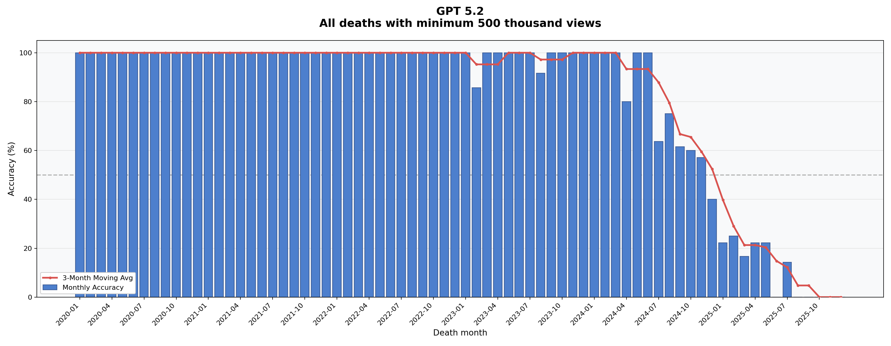
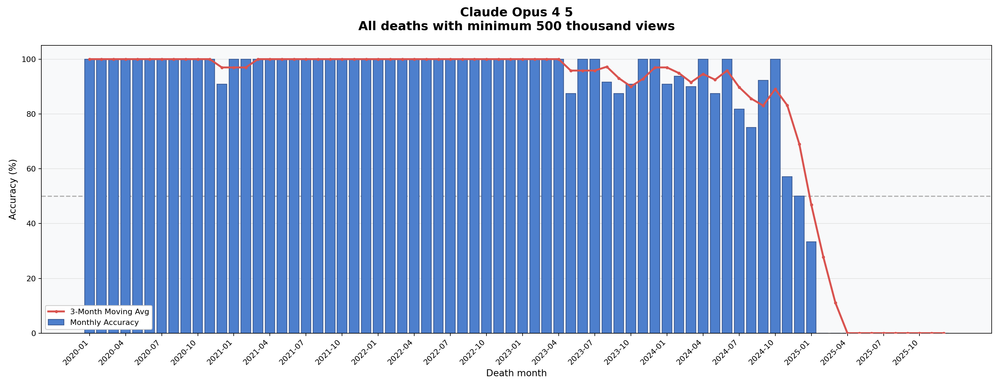
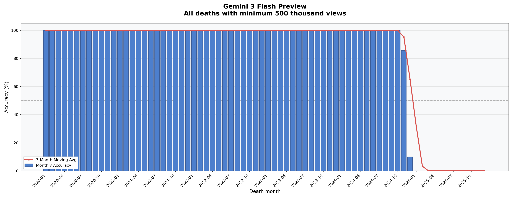
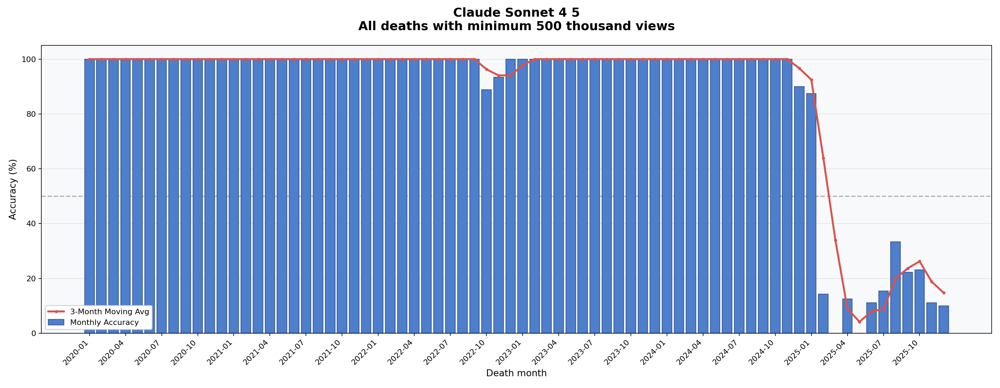
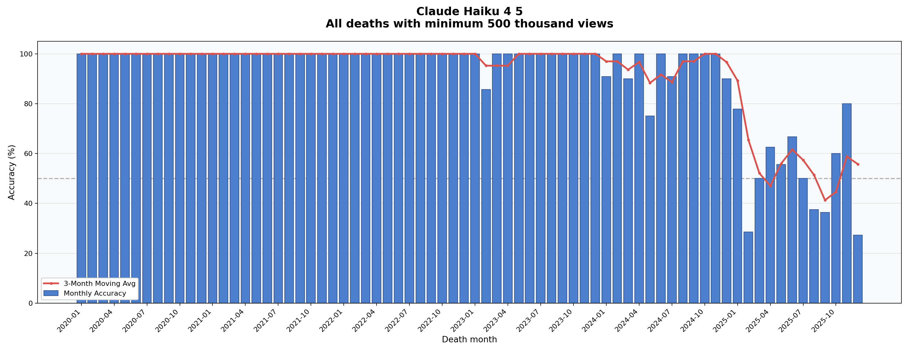
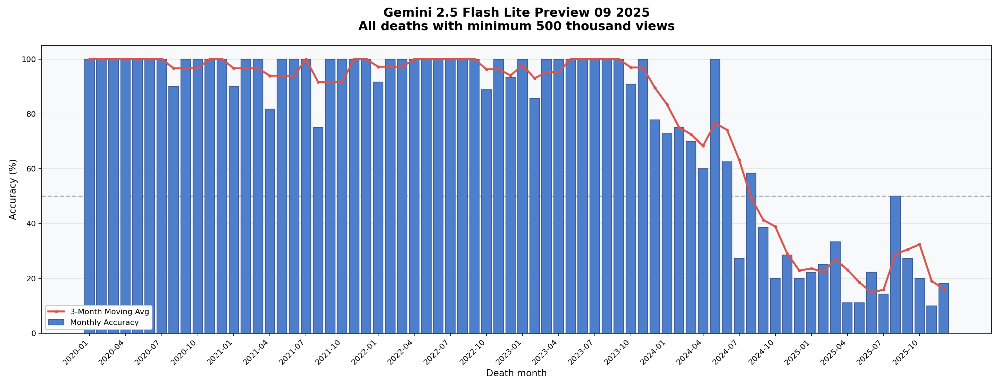

### Goal
Modern CoT LLMs can solve bachelor and master-level problems in basically any field. . Except, they are very bad any field which requires recent knowledge (like current news, AI development or recursive self-improvement). This is because they simply lack sufficient training data on recent events and developments. While this can be band-aided by adding search tools or extra information in-context, my results show that the models' internal reasoning regarding recent developments is still very poor. For example, if you ask a model to reason about its own capabilities or current-day LLM developments, it struggles significantly. To systematically study and address this knowledge gap, we first need a reliable way to map exactly where a model's internal knowledge ends.

### Methodology
To test the models, I needed absolute, binary data attached to specific dates to easily determine if a model knows (or doesn't know) a fact. The deaths of notable people proved to be the perfect metric for this. 

A problem I encountered during initial testing is that baseline knowledge of notable people varies wildly per model (e.g., Gemini models know about >5x more people than GPT-5 and Claude models). To solve this, I designed the testing pipeline in two phases:
1. **Knowledge check:** I first ask the model to provide the birth year of a person to determine if the model "knows" them. 
2. **Status check:** If successful, I send a second batch of requests asking if the people the model thinks those people are still alive, according to its latest internal knowledge.

While a model could theoretically start guessing that older individuals have died by now, we do not see this behavior significantly in models like Gemini 3 Flash. It accurately determines a person's death up to its cutoff period (Dec 2024 - Jan 2025) and never claims someone is dead if they died after its cutoff period (Feb - Dec 2025). 

Because this task is purely based on internal knowledge retrieval and does not require reasoning, I suspect the performance improvement from additional reasoning tokens is marginal. This is an area I intend to research further.

### Data collection
I initially wanted to use Wikidata, but the API is quite inconvenient for this specific use case. Instead, I determined that the Wikipedia API is much better suited: the "notable deaths in `<month>`" pages are in a highly structured format with very few exceptions. My script automatically notifies me of those exceptions so I can fix them manually. 

This results in a high-quality dataset of $N=43,082$ data points spanning the period of Jan 2020 - Dec 2025.

### Key results (WIP)
*Tested models: Claude Haiku/Sonnet/Opus 4.5, Gemini 3 Flash, Gemini 2.5 Flash Lite, GPT-5.2*

- **Cutoff Sharpness:** Gemini models have a very sharp cutoff date of 1-2 months, whereas Claude and GPT-5 models exhibit a slow decay/long cutoff period spanning 6 months to 2 years (!).
- **Stated vs. Actual Cutoff:** The findings for Claude and GPT-5 severely contradict the suppliers' official specifications of an "August 2025" cutoff (knowledge accuracy at that specific point is <25% of baseline).
- **Knowledge Base:** Gemini models "know" significantly more people (up to >5x more) than Claude and GPT-5 models.
- **Model Size:** Gemini 2.5 Flash Lite is significantly worse at this task than Gemini 3 Flash.

#### Preliminary result graphs
*These preliminary graphs based on an older methodology using a fixed threshold of minimum 500000 Wikipedia views in the 60 days prior to the death.*

##### GPT-5.2

##### Claude Opus 4.5

##### Gemini 3 Flash Preview

##### Claude Sonnet 4.5

##### Claude Haiku 4.5

##### Gemini 2.5 Flash Lite Preview 09-2025

### Disclaimer
This repository is of my rough quick tests, not any final research. The project is by no means finished. While I have a multitude of ideas and would prefer to test all available models, I unfortunately currently lack the time to do so, as other priorities require my time. I have made this repository public to share the methodology, but please excuse the chaotic codebase. 

### Future Research Directions
- **Full implementation:** Run the complete two-step pipeline on all models (the current WIP graphs are based on a fixed cutoff utilizing the number of Wikipedia views the person received 60 days prior to their death).
- **Provider & size trends:** Test if the same patterns emerge historically and with newer models regarding Google vs. OpenAI/Anthropic, and small vs. large models. 
- **Open source models:** Test open-source models (Gemma is especially interesting). Google is an outlier here due to their immense data collection ability. *Hypothesis:* This outlier capability (knowing more people, having a sharper cutoff date) is likely attributable to Google Search results data integration during the main training phase.
- **Continual learning:** Grok is often attributed as having better "continual learning." I want to test the Grok models. *Hypothesis:* Their knowledge of recent deaths will not be statistically significant (>>50% success rate), as I suspect post-training is simply incapable of giving models true internalized knowledge. If it *is* statistically significant, this becomes a major area for further research.
- **Scaling laws on knowledge:** Test the effect of small vs. large models. *Hypothesis:* There will be a clear trend where large models perform better at raw recall.
- **Reasoning tokens:** Test the effect of reasoning tokens on model performance. *Hypothesis:* A small amount of reasoning (e.g., ~200 tokens) will slightly improve performance by helping the model "dig up" associated memories of death announcements in its weights. However, beyond that, the performance increase will plateau since this is fundamentally a retrieval task, not a reasoning task.
